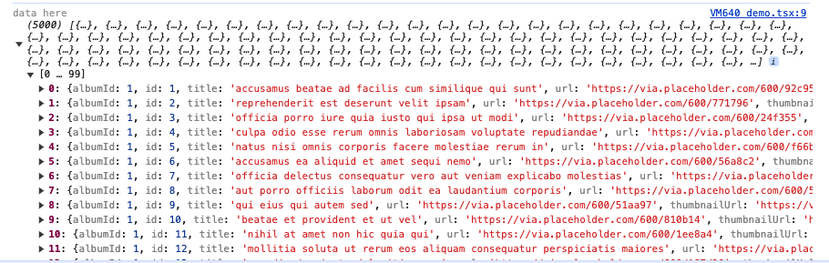

## Next Redux Fetch

- Integrate Redux dispatch api actions into your existing Next JS project.

### Dev in Progress.

### To use

- `yarn add next-redux-fetch`

### Current flow might change

#### 1) Declare thunk functions

---

```javascript
import { createAsyncThunk, createSlice } from "@reduxjs/toolkit";
export const fetchContent = createAsyncThunk(
  "content/fetchContent",
  async () => {
    const res = await fetch("https://jsonplaceholder.typicode.com/photos");
    const data = await res.json();
    return data;
  },
);

export const fetchContent1 = createAsyncThunk(
  "content/fetchContent",
  async () => {
    const res = await fetch("https://jsonplaceholder.typicode.com/posts");
    const data = await res.json();
    return data;
  },
);
```

#### 2) import in `createReduxFetch`

---

```javascript
import { fetchContent, fetchContent1 } from "./thunkActions";
import { createReduxFetch } from "../../../next-redux-fetch";
import { configureStore } from "@reduxjs/toolkit";
export const store = createReduxFetch({
  reducer: {},
  thunkActions: {
    fetchContent,
    fetchContent1
  },
});
....
```

#### 3) Declare `getData` callback as followed:

---

```javascript
import { store } from "../../../redux/store/store";
import Bootstrap from "./bootstrap";

async function getData() {
  const res = await store.dispatch(store.thunkActions.fetchContent());

  return res;
}

export default async function Page() {
  const data = await getData();

  console.log("data", data?.payload);

  return <Bootstrap data={data} />;
}
```

### Result

---


